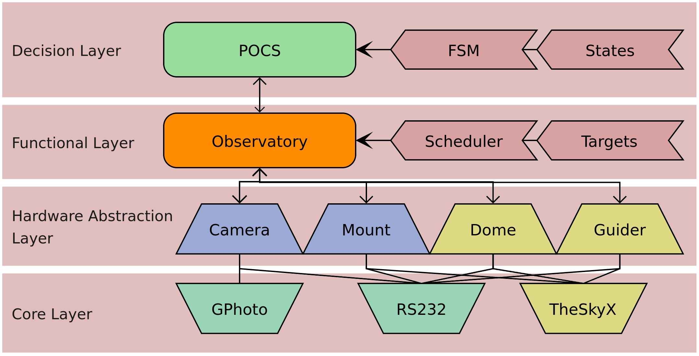

PANOPTES Observatory Control System - 	POCS
============================================

.. seealso::

	This is the documentation for the software that controls a running
	PANOPTES robotic observatory. This will mostly be useful for developers
	working on the control software itself. Normal operating usage of POCS
	doesn't require knowledge of the documentation here.

	If you are interested in how to operate a PANOPTES unit, please see the
	`Community Forum <https://forum.projectpanoptes.org>`_.

POCS
----

POCS is in charge of controlling a PANOPTES unit (which is considered to be an
"observatory"), acting like its' "brains" to determine what actions the unit should
take.

POCS uses logic in the finite state machine (FSM) to move the `Observatory` between
possible ``States`` (e.g., ``observing``, ``slewing``, ``parking``).

The `Observatory` interacts with various pieces of hardware through an abstraction
layer (HAL). This means you can call ``pocs.observatory.mount.park`` and the attached
mount should be able to park itself regardless of what type of mount it is.

It is also possible to manually control POCS, in which cause you become the "brains"
and take over the logic from the FSM.

PANOPTES
--------

`PANOPTES <https://projectpanoptes.org>`_ is an open source citizen science
project that is designed to find exoplanets with digital cameras. The goal of
PANOPTES is to establish a global network of of robotic cameras run by amateur
astronomers and schools in order to monitor, as continuously as possible, a
very large number of stars. For more general information about the project,
including the science case and resources for interested individuals, see the
`project website <https://projectpanoptes.org/>`_.

.. toctree::
   :maxdepth: 4
   :caption: Contents:

   modules
   pocs-overview
   panoptes-overview

Project Links
-------------

* PANOPTES Homepage: https://projectpanoptes.org
* Forum: https://forum.projectpanoptes.org

POCS Details
------------
* `Source Code <https://github.com/panoptes/POCS>`_
* `Release History <https://github.com/panoptes/POCS/blob/master/CHANGELOG.md>`_
* `Known Issues <https://github.com/panoptes/POCS/issues>`_
* `License <https://github.com/panoptes/POCS/blob/master/LICENSE.txt>`_

Index
-----

* :ref:`genindex`
* :ref:`modindex`
* :ref:`search`
